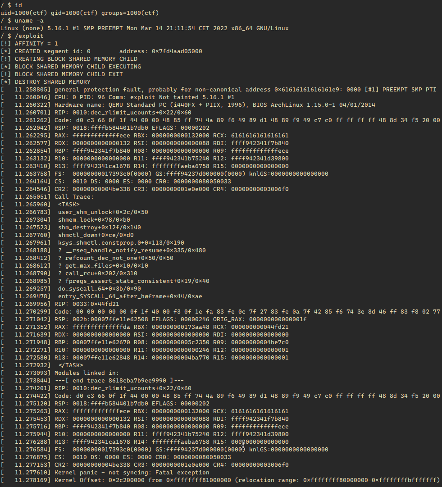

# CVE-2022-24122

Simple Denial of Service using [CVE-2022-24122](https://nvd.nist.gov/vuln/detail/CVE-2022-24122)

It works with 1 core system and it has ~80% probability of success with 2 cores.

